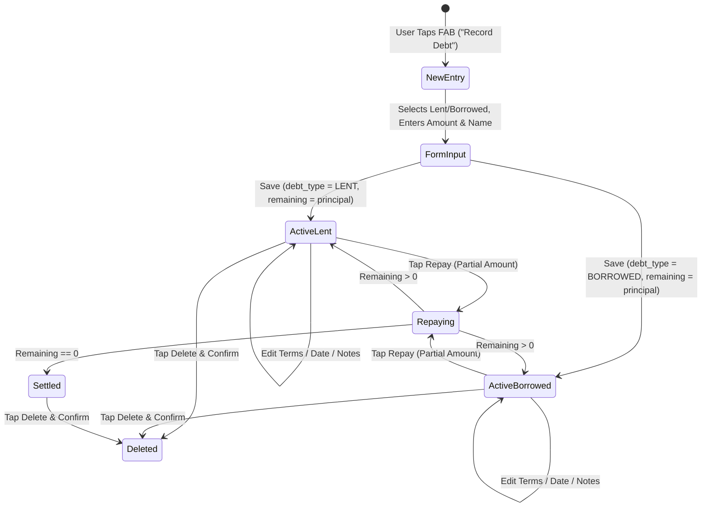

# CashFlow — Debts & Udhaar Ledger Feature Specification
**Document Version:** 1.0.0  
**Project:** CashFlow (Personal Finance & Expense Tracker for Android)  
**Package:** `com.samarth.cashflow.ui.debt` / `com.samarth.cashflow.data`  
**Architecture:** Android Jetpack MVVM (Room + LiveData + ViewModel + Material 3)  
**Status:** Implemented & Production Ready  

---

## 1. Executive Summary & Vision

The **Debts & Udhaar Ledger** feature in CashFlow is a dedicated peer-to-peer financial tracking module designed for informal, zero-interest personal lending and borrowing. Rooted in the traditional Indian *khata / bahi-khata* (credit/debit diary) workflow, it bridges informal interpersonal cash exchanges with modern digital bookkeeping.

### Key Value Propositions
- **Dual Direction Tracking**: Clear demarcation between money you lent (*"You'll Get" / Receivable*) and money you borrowed (*"You Owe" / Payable*).
- **Phonebook & Contact Integration**: Instant population of counterparty details using Android's native contact picker without manual typing.
- **One-Tap Follow-up Actions**: Direct phone call triggering and customizable WhatsApp/SMS reminder dispatching using Android's Intent system.
- **Partial Repayments & Auto-Settlement**: Support for installment-based settlements with real-time remaining balance calculations and automatic status transitions (`ACTIVE` ➔ `SETTLED`).
- **Live Interactive Preview**: A hero card modeled after Stitch Screen 13 that dynamically visualizes debt direction, amount, and counterparty as the user fills the form.
- **100% Offline & Private**: All contact numbers, amounts, and notes stay strictly on-device in an encrypted Room SQLite database.

---

## 2. Product Requirements & User Stories

### 2.1 User Personas & Use Cases
1. **The Friendly Lender**: Often covers friends' dinner bills, cab rides, or short-term cash needs. Needs a simple ledger to track who owes what, send polite reminders, and log partial settlements.
2. **The Borrower**: Borrows money for rent or temporary emergencies from family/friends. Wants to know total outstanding liabilities ("You Owe") and due dates to avoid defaulting on relationships.
3. **The Small Merchant / Freelancer**: Tracks informal customer advances or vendor credits without needing complex, heavy enterprise accounting software.

### 2.2 User Stories
| ID | As a... | I want to... | So that... |
|:---|:---|:---|:---|
| **US-D1** | User | Pick a person directly from my phone contacts | I don't have to manually type their name or phone number. |
| **US-D2** | User | See separate summary totals for "You'll Get" and "You Owe" | I can immediately see my net outstanding receivable and payable position. |
| **US-D3** | User | Filter debts by All, To Receive (Lent), and To Pay (Borrowed) | I can focus only on what's actionable without clutter. |
| **US-D4** | User | Tap "Call" on any debt card | Android launches the phone dialer with the person's number preloaded. |
| **US-D5** | User | Tap "Remind" on a lent entry | The app opens WhatsApp or messaging apps with a pre-composed polite reminder message. |
| **US-D6** | User | Log partial payments over time | The remaining balance updates automatically, and settles once paid off. |
| **US-D7** | User | Set an optional settlement due date | I have a clear deadline for repayments. |

---

## 3. UI/UX & Design System Integration

The Debts feature adheres to CashFlow's **Forest Green & Emerald** Material 3 Design System (Stitch Screen 12 & Screen 13 specifications).

### 3.1 Color Tokens
| Semantic Role | Hex Code | Usage in Debts |
|:---|:---|:---|
| **Canvas Background** | `#F9FAFB` | Main fragment background (`@color/bg_canvas`) |
| **Card Surface** | `#FFFFFF` | Debt item cards, metric summary containers |
| **Border Subtle** | `#E5E7EB` | 1dp outline around cards, chips, input fields |
| **Emerald Primary** | `#059669` / `#10B981` | "You'll Get" (Lent) badges, receivable amounts, repay buttons |
| **Forest Green Hero** | `#023826` to `#034932` | FAB gradient, active "I Lent" tab, live preview header card |
| **Danger Coral** | `#DC2626` / `#EF4444` | "You Owe" (Borrowed) badges, payable amounts, delete icons |
| **Text Primary** | `#111827` | Counterparty names, principal amounts |
| **Text Secondary** | `#6B7280` | Due dates, notes, subtitle indicators |

### 3.2 Screens & Components

#### A. Debts Ledger Screen (`DebtsFragment` — `fragment_debts.xml`)
- **Metric Cards Header**: Two equal-width cards in a horizontal row:
  - *Left Card*: "You'll Get (Lent)" — Emerald `#059669`, tabular numerals (`tnum`).
  - *Right Card*: "You Owe (Borrowed)" — Coral `#DC2626`, tabular numerals (`tnum`).
- **Filter Chip Group**: Material 3 single-selection chips (`All Debts`, `To Receive`, `To Pay`).
- **RecyclerView**: Displays debt ledger cards with animated `DiffUtil` updates.
- **Empty State**: Centered `ic_debts` illustration with helpful helper text when no records match.
- **Extended FAB**: `Record Debt` with `@drawable/ic_add` and Forest Green elevation styling.

#### B. Individual Debt Item Card (`item_debt.xml`)
- **Header**:
  - Person's display name (`android:textSize="16sp"`, bold).
  - Debt direction badge: `"Lent (To Receive)"` (Green) or `"Borrowed (To Pay)"` (Red).
  - Quick action icons: Edit (`ic_edit`) and Delete (`ic_delete`).
- **Middle Row**:
  - Due date badge (e.g., `"Due: 2026-09-30"` or `"No due date"`).
  - Remaining amount highlighted prominently (e.g., `₹4,500.00`).
- **Action Strip (3 Buttons)**:
  1. **Call**: Outlined button invoking `Intent.ACTION_DIAL`.
  2. **Remind**: Emerald-bordered button launching Android's app chooser with a formatted reminder string.
  3. **Repay**: Solid Emerald button opening a quick-repay dialog to record a partial or full payment.

#### C. Record / Edit Debt Dialog (`dialog_add_debt.xml`)
- **Stitch Live Preview Card**: A Forest Green card with subtle background watermark (`₹`) that reflects changes in real-time:
  - Direction badge (`"You'll Receive"` vs. `"You Owe"`).
  - Principal amount formatted dynamically with `₹` currency symbol.
  - Subtitle text (e.g., `"Lending to Rahul Sharma"` or `"Borrowed from Amit Verma"`).
  - Footer tag: `"Active Ledger Entry • Zero-interest Udhaar"`.
- **Direction Toggle**: Segmented two-button toggle between `"I Lent (Give)"` and `"I Borrowed (Owe)"`.
- **Principal Amount Input**: Numeric input with quick-increment chip helpers:
  - `+₹500` | `+₹1,000` | `+₹2,000` | `+₹5,000`
- **Contact Row**: Counterparty name input with an adjacent `"Pick Contact"` button.
- **Phone Number Input**: Sanitized phone field auto-filled upon selecting a contact.
- **Due Date Picker**: Tap-to-pick date dialog (`DatePickerDialog`).
- **Notes Field**: Optional text field for transaction context (e.g., "Dinner split", "Advance for groceries").

---

## 4. Technical Architecture & Component Hierarchy

CashFlow adheres to clean MVVM architecture with unidirectional data flow and repository pattern.

```
┌─────────────────────────────────────────────────────────────────┐
│                           UI Layer                              │
│  ┌───────────────────────┐           ┌───────────────────────┐  │
│  │     DebtsFragment     │◀─────────▶│      DebtAdapter      │  │
│  └───────────┬───────────┘           └───────────────────────┘  │
└──────────────┼──────────────────────────────────────────────────┘
               │ Observes LiveData / Dispatches Actions
┌──────────────▼──────────────────────────────────────────────────┐
│                        ViewModel Layer                          │
│  ┌───────────────────────────────────────────────────────────┐  │
│  │                       DebtViewModel                       │  │
│  └───────────────────────────┬───────────────────────────────┘  │
└──────────────────────────────┼──────────────────────────────────┘
               │ Calls Repository
┌──────────────▼──────────────────────────────────────────────────┐
│                       Repository Layer                          │
│  ┌───────────────────────────────────────────────────────────┐  │
│  │                      DebtRepository                       │  │
│  └─────────────┬───────────────────────────────┬─────────────┘  │
└────────────────┼───────────────────────────────┼────────────────┘
                 │                               │
┌────────────────▼─────────────┐   ┌─────────────▼────────────────┐
│           DebtDao            │   │       DebtRepaymentDao       │
└──────────────┬───────────────┘   └─────────────┬────────────────┘
               │                                 │
┌──────────────▼─────────────────────────────────▼────────────────┐
│                      SQLite Room Database                       │
│  ┌───────────────────────────┐   ┌───────────────────────────┐  │
│  │           debts           │1:N│      debt_repayments      │  │
│  └───────────────────────────┘   └───────────────────────────┘  │
└─────────────────────────────────────────────────────────────────┘
```

---

## 5. Database Schema & Data Models

### 5.1 `debts` Table (`Debt.java`)
Represents an individual lending or borrowing agreement.

| Column Name | SQLite Data Type | Constraints | Description |
|:---|:---|:---|:---|
| `id` | `INTEGER` | `PRIMARY KEY AUTOINCREMENT` | Unique identifier for debt |
| `person_name` | `TEXT` | `NOT NULL` | Name of debtor or creditor |
| `person_contact_number` | `TEXT` | `NULLABLE` | Phone number for calls/reminders |
| `debt_type` | `TEXT` | `NOT NULL` | `'LENT'` or `'BORROWED'` |
| `initial_amount` | `REAL` | `NOT NULL` | Original transaction principal |
| `remaining_amount` | `REAL` | `NOT NULL` | Outstanding balance to be settled |
| `due_date` | `TEXT` | `NULLABLE` | Due date formatted as `YYYY-MM-DD` |
| `notes` | `TEXT` | `NULLABLE` | Context or memo |
| `status` | `TEXT` | `NOT NULL` | `'ACTIVE'` or `'SETTLED'` |
| `reminder_enabled` | `INTEGER` | `NOT NULL` (Boolean) | Flag for due-date notification |
| `created_at` | `INTEGER` | `NOT NULL` (Epoch millis) | Timestamp of creation |

**Indices:**
- `index_debts_debt_type` on `debt_type`
- `index_debts_status` on `status`

### 5.2 `debt_repayments` Table (`DebtRepayment.java`)
Tracks chronological installment payments made against a specific debt.

| Column Name | SQLite Data Type | Constraints | Description |
|:---|:---|:---|:---|
| `id` | `INTEGER` | `PRIMARY KEY AUTOINCREMENT` | Repayment log identifier |
| `debt_id` | `INTEGER` | `FK -> debts(id) ON DELETE CASCADE` | Parent debt record reference |
| `amount` | `REAL` | `NOT NULL` | Repayment amount |
| `notes` | `TEXT` | `NULLABLE` | Method/memo (e.g. "GPay", "Cash") |
| `repayment_date` | `TEXT` | `NOT NULL` | Repayment date (`YYYY-MM-DD`) |

**Indices:**
- `index_debt_repayments_debt_id` on `debt_id`

---

## 6. Business Logic & Query Workflows

### 6.1 Aggregate Metrics Queries (`DebtDao.java`)
Real-time summary calculation for the top cards:
```sql
-- Total money lent out that is still pending receipt
SELECT COALESCE(SUM(remaining_amount), 0.0) 
FROM debts 
WHERE debt_type = 'LENT' AND status = 'ACTIVE';

-- Total money borrowed that is still pending repayment
SELECT COALESCE(SUM(remaining_amount), 0.0) 
FROM debts 
WHERE debt_type = 'BORROWED' AND status = 'ACTIVE';
```

### 6.2 Atomic Repayment & Auto-Settlement (`DebtRepaymentDao.java`)
When a user records an installment, an atomic `@Transaction` method executes:
```java
@Transaction
public void recordRepayment(DebtRepayment repayment, DebtDao debtDao) {
    // 1. Insert repayment history record
    insert(repayment);

    // 2. Fetch current debt balance synchronously
    Debt debt = debtDao.getDebtByIdSync(repayment.getDebtId());
    if (debt != null) {
        // 3. Deduct repayment amount, clamped at 0.0
        double newRemaining = Math.max(0.0, debt.getRemainingAmount() - repayment.getAmount());
        
        // 4. Auto-settle if balance reaches zero
        String newStatus = newRemaining <= 0.0001 ? "SETTLED" : "ACTIVE";
        
        // 5. Update debt balance and status
        debtDao.updateRemainingAndStatus(debt.getId(), newRemaining, newStatus);
    }
}
```

---

## 7. Android System Integrations

### 7.1 Contact Picker Integration
- **Permission**: `android.permission.READ_CONTACTS`.
- **Workflow**:
  1. Checks permission via `ContextCompat.checkSelfPermission`.
  2. If not granted, requests it dynamically via `ActivityResultContracts.RequestPermission()`.
  3. Launches native contact picker intent:
     ```java
     Intent intent = new Intent(Intent.ACTION_PICK, ContactsContract.CommonDataKinds.Phone.CONTENT_URI);
     contactPickerLauncher.launch(intent);
     ```
  4. Queries projection `[DISPLAY_NAME, NUMBER]` and strips non-numeric formatting (preserving leading `+`):
     ```java
     String cleanPhone = rawPhone.replaceAll("[^0-9+]", "");
     ```

### 7.2 Native Phone Dialer
- Invokes `Intent.ACTION_DIAL` with `tel:<number>`.
- Allows the user to confirm before the call connects, complying with Google Play privacy policies without requiring dangerous `CALL_PHONE` background execution.

### 7.3 Smart App Chooser (WhatsApp, SMS, Telegram Reminders)
- Uses Android's generic `Intent.ACTION_SEND` wrapped in `Intent.createChooser()`.
- Generates a courteous, pre-formatted message:
  > *"Hi [Person Name], gentle reminder regarding pending payment of ₹[Remaining Amount] on CashFlow."*
- User can send via WhatsApp, WhatsApp Business, SMS Messenger, Telegram, Signal, or Email.

---

## 8. State Transitions & Lifecycle



---

## 9. Key Source Files & Implementation Map

| File Path | Description | Key Classes / Resources |
|:---|:---|:---|
| `app/src/main/java/.../data/entity/Debt.java` | Room entity for debt agreement | `@Entity(tableName = "debts")` |
| `app/src/main/java/.../data/entity/DebtRepayment.java` | Room entity for repayments | `@Entity(tableName = "debt_repayments")` |
| `app/src/main/java/.../data/dao/DebtDao.java` | Data access object for debts & aggregates | `getDebtsByType()`, `getTotalReceivable()` |
| `app/src/main/java/.../data/dao/DebtRepaymentDao.java` | Data access object with atomic repayment | `recordRepayment()` |
| `app/src/main/java/.../data/repository/DebtRepository.java` | Clean repository with async executor | `DebtRepository` |
| `app/src/main/java/.../viewmodel/DebtViewModel.java` | AndroidViewModel exposing LiveData | `DebtViewModel` |
| `app/src/main/java/.../ui/debt/DebtsFragment.java` | Primary fragment controller & UI listeners | `DebtsFragment` |
| `app/src/main/java/.../ui/debt/DebtAdapter.java` | ListAdapter with DiffUtil & ViewHolder | `DebtAdapter`, `OnDebtActionListener` |
| `app/src/main/res/layout/fragment_debts.xml` | Screen 12 Debts Ledger layout | Summary cards, ChipGroup, RecyclerView |
| `app/src/main/res/layout/item_debt.xml` | Single debt item card layout | Action buttons (Call, Remind, Repay) |
| `app/src/main/res/layout/dialog_add_debt.xml` | Screen 13 Add/Edit Debt Dialog | Live preview card, quick chips, contact picker |

---

## 10. Future Enhancements & Roadmap

1. **WorkManager Due Date Notifications**: Automated background check scheduled 24 hours and on the morning of `due_date` to push a local Android notification.
2. **UPI Payment Request Generation**: Integration of `upi://pay` deep link generator allowing borrowers to directly scan or tap to settle via Google Pay, PhonePe, or Paytm.
3. **Wallet Balance Deduction Hook**: Option during repayment to automatically deduct the amount from a designated Wallet/Account (e.g. Cash or Bank Account).
4. **Export Ledger Statement**: Generation of an individual customer PDF statement summarizing initial debt, repayment timestamps, and remaining balance.
